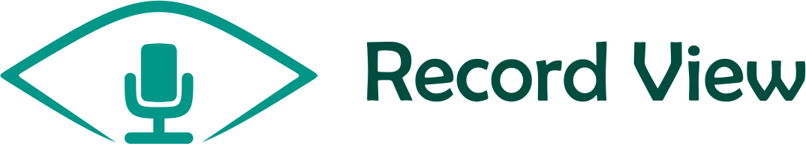

# iRecordView



a Simple Audio Recorder View with hold to Record Button and Swipe to Cancel

[](https://cocoapods.org/pods/iRecordView)
[](https://cocoapods.org/pods/iRecordView)
[](https://cocoapods.org/pods/iRecordView)


## Demo
<p align="center">

</p>


## Installation

iRecordView is available through [CocoaPods](https://cocoapods.org). To install
it, simply add the following line to your Podfile:

```ruby
pod 'iRecordView'
```
## Usage
add the views `RecordButton` and `RecordView` to your **ViewController** using Code or Storyboard

```swift
    let recordButton = RecordButton()
    recordButton.translatesAutoresizingMaskIntoConstraints = false

    let recordView = RecordView()
    recordView.translatesAutoresizingMaskIntoConstraints = false

    view.addSubview(recordButton)
    view.addSubview(recordView)

    recordButton.widthAnchor.constraint(equalToConstant: 35).isActive = true
    recordButton.heightAnchor.constraint(equalToConstant: 35).isActive = true

    recordButton.trailingAnchor.constraint(equalTo: view.trailingAnchor, constant: -8).isActive = true
    recordButton.bottomAnchor.constraint(equalTo: view.safeBottomAnchor, constant: -16).isActive = true


    recordView.trailingAnchor.constraint(equalTo: recordButton.leadingAnchor, constant: -20).isActive = true
    recordView.leadingAnchor.constraint(equalTo: view.leadingAnchor, constant: 10).isActive = true
    recordView.bottomAnchor.constraint(equalTo: recordButton.bottomAnchor).isActive = true
```
now add your  `recordView`  to `recordButton`
```swift
    //IMPORTANT
    recordButton.recordView = recordView
```
now you can observe the states using the delegate

```swift
    recordView.delegate = self
```
this will give you 4 functions 
    
```swift
    func onStart() {
    //start recording
    print("onStart")
    }
    
    func onCancel() {
    //when users swipes to delete the Record
    print("onCancel")
    }
    
    func onFinished(duration: CGFloat) {
    //user finished recording 
    print("onFinished \(duration)")
    }
    
    //optional
    func onAnimationEnd() {
    //when Trash Animation is Finished
    print("onAnimationEnd")
    }
```
## Customization
```swift

//Cancel Record when Slide To Cancel view gets before duration time + offset  
recordView.offset = 20

//enable/disable Record Sounds
recordView.isSoundEnabled = true

recordView.durationTimerColor = .red

recordView.smallMicImage = myImage

recordView.slideToCancelText = "Test"

recordView.slideToCancelTextColor = .red

recordView.slideToCancelArrowImage = myImage

//to Handle Clicks by RecordButton you have to disable touch Gesture by using
recordButton.listenForRecord = false
```
  
    
## Author

AbdulAlim Rajjoub

## Thanks/Credits
[RATTLESNAKE-VIPER](https://github.com/RATTLESNAKE-VIPER) for [GLMoveToTrashAnimation](https://github.com/RATTLESNAKE-VIPER/GLMoveToTrashAnimation)

## Looking for Android Version?
try out [RecordView](https://github.com/3llomi/RecordView)

## License

iRecordView is available under the MIT license. See the LICENSE file for more info.
